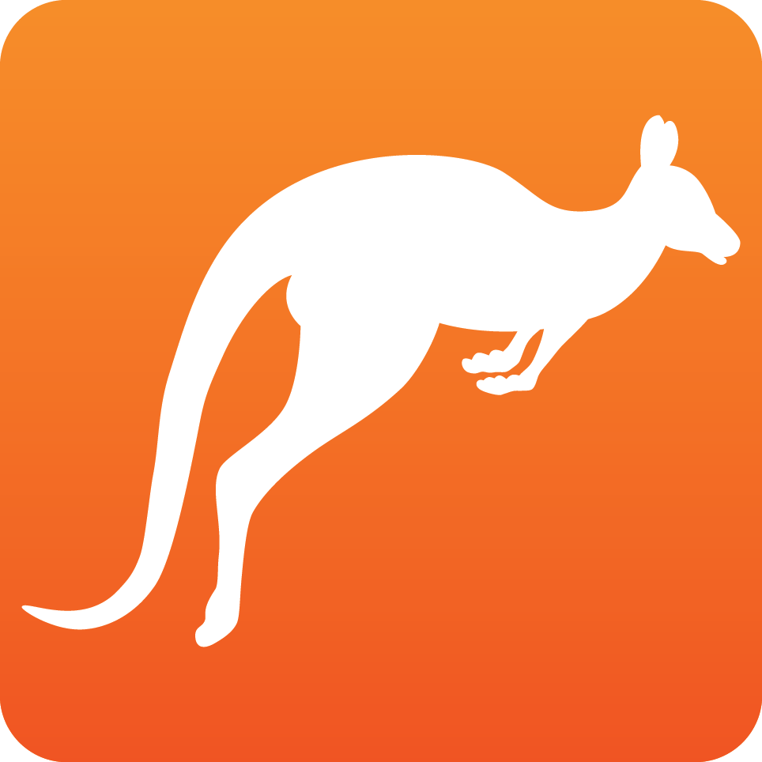

<br>
<div align="center">

<a href="https://osticket.com">
  
</a>  

<h3 align="center">osTicket - Responsive</h3>

  <p align="center">
    Modified, responsive version of the popular ticketing system, osTicket. 
    <br>
  </p>
</div>


## About The Project

This is a modified version of **osTicket** that aims to be responsive, more usable for devices with touchscreens and look slightly more modern. For more info, please visit the official repo [here](https://github.com/osTicket/osTicket).

<br>

### Built with
* 
* 
* 
* 


<p align="right">(<a href="#readme-top">back to top</a>)</p>

## Getting Started

### Requirements 

(From the official repo of **osTicket**)
  * HTTP server running Microsoft® IIS or Apache
  * PHP version 8.0
  * mysqli extension for PHP
  * MySQL database version 5.5

### Recommendations
(From the official repo of **osTicket**)
  * gd, gettext, imap, json, mbstring, and xml extensions for PHP
  * APC module enabled and configured for PHP

### Installation

1. Clone the repo

    ```properties
    git clone git@github.com:B0ras/osTicketResponsive.git
    ```

2. deploy the code into somewhere in your server's www root folder, for
instance

    ```properties
    cd osTicketResponsive
    php manage.php deploy --setup /var/www/htdocs/osticketResponsive/
    ```

### Development Dependencies

1. Sass Compiler
  ##### npm:
   ```properties
   npm i -g sass
   ```
  ##### or yarn:
  ```properties
  yarn global add sass
  ```

2. Bootstrap 5.2.3

  ##### npm:
   ```properties
   npm i bootstrap@5.2.3
   ```
  ##### or yarn:
  ```properties
  yarn add bootstrap@5.2.3
  ```

3. Bootstrap Icons
   
  ##### npm:
   ```properties
   npm i bootstrap-icons@5.2.3
   ```
  ##### or yarn:
  ```properties
  yarn add bootstrap-icons@1.10.3
  ```  

### Compiling Sass files

Bootstrap was used in order to make sure that responsiveness would work as smoothly as possible on all screen sizes. Not everything was necessary so it was modified using Sass to keep the bundle size to the minimum.

* For the setup wizard: 

```properties
sass osTicketResponsive/scss/styles.scss osTicketResponsive/setup/css/wizard_responsive.css --style compressed
```

* For the admin/agent panel: 

```properties
sass osTicketResponsive/scss/scp.scss osTicketResponsive/scp/scc/scp_responsive.css --style compressed
```

* For the client: 

```properties
sass osTicketResponsive/scss/theme.scss osTicketResponsive/assets/default/css/theme_responsive.css --style compressed
```

## Contributing
If you have an idea on how to make the project better it would be a good idea to open up an issue. If you want to make a pull request: 

1. Fork the project
2. Create your Feature Branch (git checkout -b feature/AmazingFeature)
3. Commit your Changes (git commit -m 'Add some AmazingFeature')
4. Push to the Branch (git push origin feature/AmazingFeature)
5. Open a Pull Request
